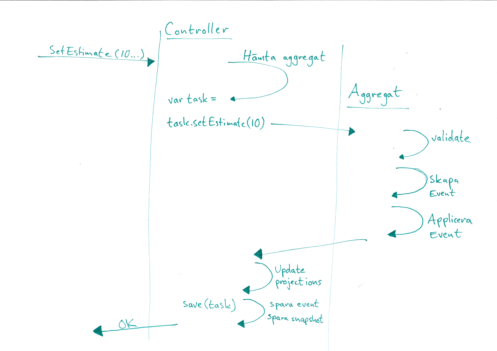

# Event sourcing
%%%
## Agenda
* Vad det är, definitioner.
* Hur vi använder det i Tickra.
* Kodexempel från Tickra.
* Reflektioner.
%%%
## Vad är event sourcing?

* Ett alternativ till vanliga CRUD-operationer direkt mot databasen.

* En serie av händelser som tillsammans beskriver ett tillstånd.

* Beskriver också hur vi tog oss till det tillståndet.

### Istället för att uppdatera en hel databasrad.

%%
## Definitioner

### Ett event är 
* En effekt av ett kommando (t.ex. ett http-anrop)
* Påverkar nuvarande state av ett aggregat.
* Immutable
* Innehåller information om vad som har ändrats.

%%
### Ett aggregat är
* Subjektet som påverkas av ett kommando.
* Applicerar affärslogik utifrån kommandot och det state aggregatet själv innehåller.
* Aggregatet genererar ett event som den applicerar på sig själv.
%%
### Ett Snapshot är
* En ögonblicksbild av ett aggregat.
* För bättre prestanda.
* Serialisering av aggregat som sparas undan.

%%
## Hur implementerar man det då?

* Relationsdatabas.
* Filer.
* Eventdatabas.

%%%
## Hur det används i Tickra
* MsSql
* Används framförallt för projekt och uppgifter.
* Events serialiseras ner som json med versionsnr i databasen.
* Snapshots i databasen.
* Snapshots går alltid att ta bort.
%%
## Eventtabell i Tickra

AggregateId | Event | Data | Version
--- | --- | ---
6bd18c | Tickra.Events.ProjectTaskCreated | {"TimeStamp":..} | 1
6bd18c | ProjectTaskEstimateSet | {"ProjectTaskId":..} | 2
6bd18c | ProjectTaskEstimateSet | {"ProjectTaskId":..} | 3

%%

## Flöde för en uppdatering CRUD
* En vymodell skickas in.
* Vi läser upp databasmodellen.
* Uppdaterar fält i databasmodellen från vymodell.
* Sparar ner databasmodellen.

%%

## Flöde för en uppdatering Tickra
* Ett kommando skickas in.
* Vi läser upp aggregatet:
  * Från snapshot 
  * Genom att applicera alla event på ett aggregat.
* Aggregatet applicerar kommandot på sig själv.
* Aggregatet skickar ut ett event till eventulla lyssnare
  * Lyssnare är t.ex. projektioner som behöver uppdateras.
* Event och snapshot sparas ner i databasen.
  * OptimisticConcurrencyException

%%



%%%

### Skapa en uppgift i Tickra
```cs
public class ProjectTask : AggregateRoot<ProjectTask.State>
{
    public class State
    {
        public ProjectTaskId ProjectTaskId { get; set; }
        public string Name { get; set; }
    }
    // Public method is called from controller or similar. 
    public ProjectTask(ProjectTaskId projectTaskId, projectId....)
    {
        ValidateProjectState(projectState, projectTaskId);
        ValidateDetails(name, description);
        ApplyChange(new ProjectTaskCreated(projectTaskId, projectId...));
    }
    // Apply the event to the state / snapshot
    private void Apply(ProjectTaskCreated @event)
    {
        Snapshot.ProjectTaskId = @event.ProjectTaskId;
        Snapshot.ProjectId = @event.ProjectId;
        Snapshot.Name = @event.TaskName;
    }
}
```
%%
### Sätta uppskattad tidåtgång
```cs
// Public method is called from controller or similar. 
public void SetEstimate(ProjectState projectState, int? estimate..)
{
    ValidateProjectState(projectState, Snapshot.ProjectTaskId);

    if (Snapshot.Estimate != estimate)
    {
        ApplyChange(new ProjectTaskEstimateSet(Snapshot.ProjectTaskId, estimate..));
    }
}

// Apply the event to the state / snapshot
private void Apply(ProjectTaskEstimateSet @event)
{
    Snapshot.Estimate = @event.Estimate;
    Snapshot.IsOverdrawn = false;
}
```
%%
### Projektioner
```cs
public class ProjectTaskEstimateSet : UserIssuedEvent
{
    public readonly ProjectTaskId ProjectTaskId;
    public readonly ProjectId ProjectId;
    public readonly int? Estimate;

    public ProjectTaskEstimateSet(int? estimate, DateTimeOffset timeStamp..): base(timeStamp)
    {
        ProjectTaskId = projectTaskId;
        ProjectId = projectId;
        Estimate = estimate;
    }
}
// In the projections we listen to the event and update the projection with the event.
public async Task HandleAsync(ProjectTaskEstimateSet @event)
{
    await UpdateProjectLastModified(@event.ProjectId, @event.TimeStamp);
    await UpdateProgressWithEstimateOrStatus(@event.ProjectId, @event.ProjectTaskId, @event.Estimate, null);
}
```
%%
### Läsa upp ett aggregat
```cs
public async Task<TEventSource> GetAsync(Guid aggregateId, int? version = null)
{
    var aggregate = new TEventSource();
    // Läser upp ett snapshot om det finns sparat.
    var snapshot = await _snapshotStore.LoadSnapshotAsync(aggregateId, version);
    EventStream eventStream = null;
    if (snapshot != null)
    {
        // Har vi ett snapshot så sätter populerar vi aggregatet från det.
        aggregate.LoadFromSnapshot(snapshot);
        // Läser upp eventuella events med högre version än vårat snapshot.
        eventStream = await _eventStore.LoadEventStreamAsync(aggregateId, snapshot.Version, version);
    }
    else
    {
        // Har vi inget snapshot så läser vi upp alla events.
        eventStream = await _eventStore.LoadEventStreamAsync(aggregateId, 0, version);
        if (eventStream == null)
            return null;
    }

    // Hittade vi några events så populerar vi aggregatet med dessa event.
    if (eventStream != null)
        aggregate.LoadFromHistory(eventStream);
    return aggregate;
}
```
%%
### Spara ner ett aggregat
```cs
public async Task SaveAsync(TEventSource aggregate, int? expectedVersion)
{
    // Läser upp alla events som har applicerats på aggregatet.
    var changes = aggregate.GetChanges();
    foreach (var change in changes)
    {
        var userIssuedEvent = change as UserIssuedEvent;
        if (userIssuedEvent != null)
        {
            userIssuedEvent.IssuedByUserId = _principal.Identity.GetUserId<long>();
        }
    }

    try
    {
        // Spara ner events och kolla om aggregatets version i databasen har ändrats.
        await _eventStore.AppendStreamAsync(aggregate.Id, changes, aggregate.Version);
        break;
    }
    catch (OptimisticConcurrencyException ex)
    {
        throw ex;
        //aggregate.ResolveConflicts(ex.CommittedEvents);
    }
    
    // Uppdatera snapshot.
    var snapshot = aggregate.GenerateSnapshot();
    await _snapshotStore.SaveSnapshotAsync(snapshot);
    
    // Broadcasta alla events.
    foreach (var @event in changes)
    {
        await _eventBus.PublishAsync(@event);
    }
}
```
%%
### OptimisticConcurrencyException

Vi förväntade oss att aggregatet skulle ha version 2 men hade version 3.

Exceptionet innehåller event med version 3.

Användaren får försöka igen.

#### Lösningsförslag

Eventuellt möjligt att lösa konflikten med informationen i version 3.

Kör endast ett kommando åt gången.
%%
### Storlek på aggregat
Lagom små.

Minskar risken för OptimisticConcurrencyException.
%%%
## Vad är det bra för?

* Logiken på ett ställe - i aggregatet.
* Lättare att debugga.
* Lättare att testa.
* Auditlog.
* Mer information som man kanske inte vet om man behöver.
* Flera olika projektioner utifrån multipla aggregat.
  * Slipper joins
* Påverka andra delar som WebJob.

%%%
## Vad är nackdelarna?

* Mer diskutrymme.
* Ökad komplexitet.
  * ProcessManagers.
  * Ändring av events.

%%%
## När ska man använda det?

* Komplexa entiteter med mycket affärslogik.

* Ökad spårbarhet.

* Läsprestanda.

#### Ger onödig overhead för simpla CRUD'ar.

%%%
## Färdiga alternativ med .NET api
* Eventstore
* Marten - Postgressql
* Streamstone - Azure Table Storage
%%%
## THE END